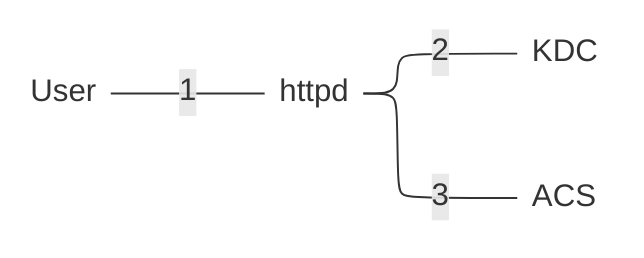
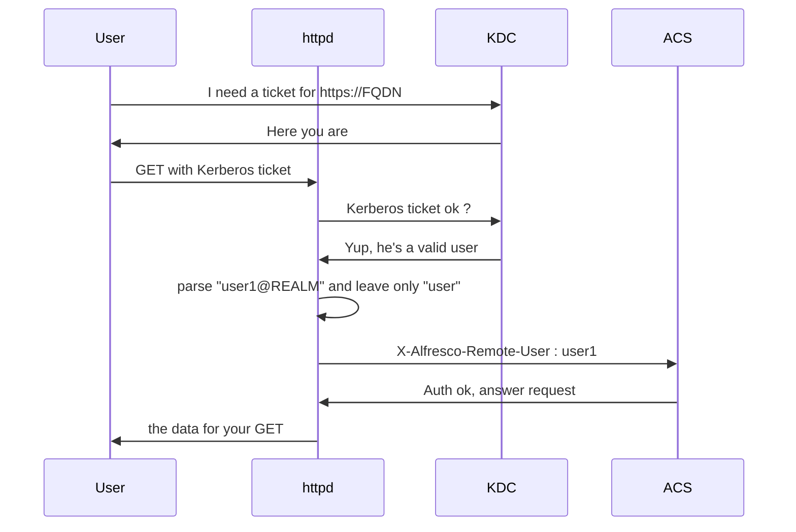

What is this guide ?

Something very basic covering only this scenario : httpd performing Kerberos authentication and then passing a parsed X-Alfresco-Remote-User header to ACS

Why ?
Because it is the only scenario that works for /alfresco /adw (Alfresco Digital Workspace) **and**/share

But ACS supports Kerberos natively.... 
True but the problem is /share (not /alfresco nor /adw) : after the Kerberos ticket has expired there's no way to have /share to renew it unless we restart the webapp.

So, the diagram is?

Not bad but something more detailed ?

