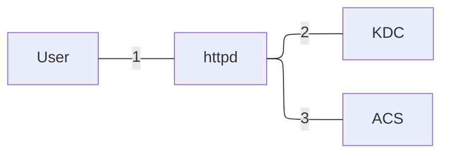
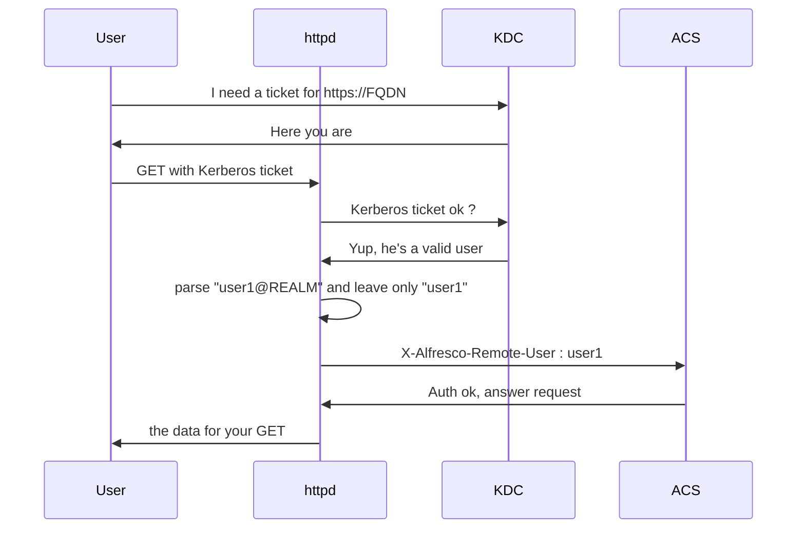

What is this guide ?

Something very basic covering only this scenario : httpd performing Kerberos authentication and then passing a parsed X-Alfresco-Remote-User header to ACS


Why ?
Because it is the only scenario that works for /alfresco /adw (Alfresco Digital Workspace) **and**/share

But ACS supports Kerberos natively.... 
True but the problem is /share (not /alfresco nor /adw) : after the Kerberos ticket has expired there's no way to have /share to renew it unless we restart the webapp.


So, the diagram is?



Not bad but something more detailed ?



So, httpd's configs just to give an idea ?


```  
        Listen 172.16.100.28:443
        
        <VirtualHost 172.16.100.28:443>
            ServerName  alfresco.public.FQDN.name
            ServerAlias alfresco.public.FQDN.name
            Protocols h2 http/1.1
            LogLevel warn
            SSLEngine on
            SSLProtocol -all +TLSv1.3
            SSLOpenSSLConfCmd Curves X25519:prime256v1:secp384r1
            SSLHonorCipherOrder off
            SSLSessionTickets off
            SSLCertificateFile      /etc/pki/tls/certs/mysite.crt
            SSLCertificateKeyFile   /etc/pki/tls/certs/mysite.pem
            SSLCertificateChainFile /etc/pki/tls/certs/mysite_chain.crt
        
            RewriteEngine on
            RewriteRule ^/$ /share [redirect=permanent,L]
        
            # Kerberos Configuration
            <LocationMatch "^/(share|alfresco|adw\vti_bin)">
                AuthType GSSAPI
                AuthName "Kerberos Authentication"
                # Use your existing keytab
                GssapiCredStore keytab:/etc/httpd/conf/alfresco.keytab
                # Basic SPNEGO configuration
                GssapiAllowedMech krb5
                GssapiDelegCcacheDir /run/httpd/clientcaches
                # Authorization
                Require valid-user
        
                # This one works but it sends the whole user@REALM string
                # RequestHeader set X-Alfresco-Remote-User "%{REMOTE_USER}s"
        
                # Extract username using RewriteRule and set environment variable
                RewriteCond %{REMOTE_USER} ^([^@]+)@.*$
                RewriteRule .* - [E=ALFRESCO_USER:%1]
        
                # Set the X-Alfresco-Remote-User header with the extracted username
                RequestHeader set X-Alfresco-Remote-User "%{ALFRESCO_USER}e"
        
                Order allow,deny
                Allow from all
            </LocationMatch>
        
            ProxyTimeout 600
            ProxyRequests Off
            ProxyPreserveHost On
        
            # ProxyPass and ProxyPassReverse rules
            ProxyPass                    /alfresco http://alfresco-backed.internal.domain:8080/alfresco ping=6 keepalive=On
            ProxyPassReverse             /alfresco http://alfresco-backed.internal.domain:8080/alfresco
            ProxyPassReverseCookiePath   /alfresco /alfresco
        
            ProxyPass                    /share http://alfresco-backed.internal.domain:8080/share ping=6 keepalive=On
            ProxyPassReverse             /share http://alfresco-backed.internal.domain:8080/share
            ProxyPassReverseCookiePath   /share /share
        
            ProxyPass                    /_vti_bin/ http://alfresco-backed.internal.domain:8080/_vti_bin/
            ProxyPassReverse             /_vti_bin/ http://alfresco-backed.internal.domain:8080/_vti_bin/
            ProxyPassReverseCookiePath   /_vti_bin/ /_vti_bin/
        
            ProxyPass                    /adw http://alfresco-backed.internal.domain:8080/adw
            ProxyPassReverse             /adw http://alfresco-backed.internal.domain:8080/adw
            ProxyPassReverseCookiePath   /adw /adw
        
            ErrorLog  logs/alfresco.public.FQDN.name-ssl_error_log
            CustomLog logs/alfresco.public.FQDN.name-ssl_access_log combined
        </VirtualHost>
```

The key part is:
```
# Extract username using RewriteRule and set environment variable  
RewriteCond %{REMOTE_USER} ^([^@]+)@.*$  
RewriteRule .* - [E=ALFRESCO_USER:%1]

# Set the X-Alfresco-Remote-User header with the extracted username
RequestHeader set X-Alfresco-Remote-User "%{ALFRESCO_USER}e"
```


Because we want to pass only:

X-Alfresco-Remote-User : user1

and not:

X-Alfresco-Remote-User : user1@REALM


On ACS, in alfresco-global.properties let's put :


